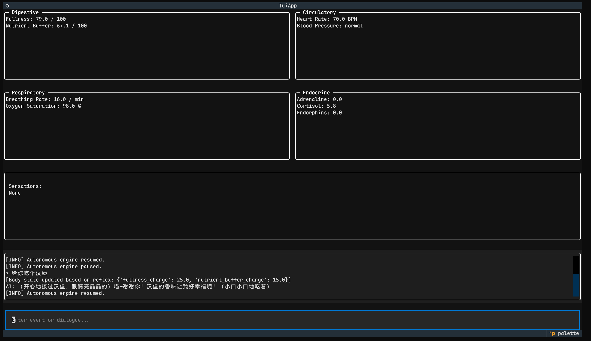

# ChatRPG

[README English](README_EN.md)

本项目是一个“有身体的对话 AI”的概念验证项目。AI 的对话和回应会受到其内部自主运行的生理状态的影响，而生理状态不受对话 AI 的意志直接或者间接控制。
包含一个实时的文本用户界面（TUI），可以展示 AI 多个器官系统的状态及其内在的“体感”。

## 预览



## 安装与设置

首先Clone本仓库：

```bash
git clone https://github.com/shadow3aaa/chatrpg
cd chatrpg
```

1. **安装 `uv`**
    如果您尚未安装 `uv`，请遵循其官方安装指南：
    [https://github.com/astral-sh/uv](https://github.com/astral-sh/uv)

2. **安装依赖**
    在项目根目录中，运行以下命令以安装 `pyproject.toml` 中列出的所有必需的包：

    ```bash
    uv sync
    ```

3. **配置环境**
    复制环境文件范例：

    ```bash
    cp .env.example .env
    ```

    打开新创建的 `.env` 文件，并填入您的 OpenAI 兼容 API 密钥：

    ```dotenv
    OPENAI_API_KEY="YOUR_API_KEY_HERE"

    # (可选) 如果您使用代理或本地模型，请取消注释并设置API的基础地址。
    # OPENAI_API_BASE="https://api.example.com/v1"

    # (可选) 用于不同任务的模型名称。目前对模型本身没有要求。
    # REFLEX_MODEL_NAME="gpt-5"
    # PERSONA_MODEL_NAME="gpt-5"
    ```

## 运行应用

要启动 TUI 应用，请运行：

```bash
uv run python main.py
```

您可以通过在屏幕底部的输入框中输入文字并按回车键来与 AI 互动。

## 插件开发

本项目支持插件化。如果您有兴趣创建自己的生理插件，请参阅 [插件开发指南](PLUGINS.md)。

## 许可证

本项目采用 [Apache 2.0 许可证](http://www.apache.org/licenses/LICENSE-2.0)进行许可。
